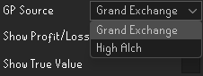
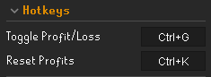
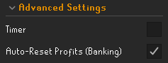
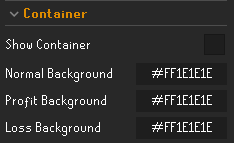
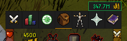
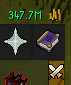
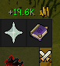
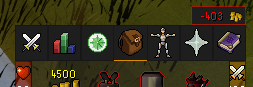
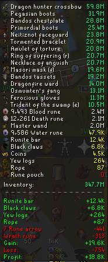

# Lite Utilities
Provides a neat oversight for the current value of your inventory.

Additionally, it keeps track of your profit and losses made during your trip!

- **Swap Between G.E and H.A prices**
- 

- **You can seamlessly toggle between Profits/Loss value and Inventory value via a configurable HotKey!**
- 

- **Setup a Timer to time your trips + Auto-reseting your timer and profits upon banking**
- 

- **Enable/Disable containers** *(border colors depending on Inv value, Profit/Loss Value)*
- 
-   <-- Inv Value Text + Border color
-   <-- Profits Text + Border color
-   <-- Loss Text + Border color

- **Hover over the coins to view the tooltip**
- 

- **Exclude items from the list by writing their name.**

## **Safety & Compliance**

All plugins that are successfully merged into the [Plugin Hub](https://github.com/runelite/plugin-hub) are reviewed and verified by the RuneLite development team, ensuring they are safe to use. For more information, you can view the [Plugin Hub readme](https://github.com/runelite/plugin-hub#Reviewing).

Furthermore, [RuneLite itself has been confirmed as fully compliant by Jagex](https://secure.runescape.com/m=news/a=13/another-message-about-unofficial-clients?oldschool=1).

---

## **Creator Tag**

For additional support or questions, reach out via [Discord](https://discord.gg/RQ9H9naf7E).