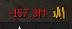
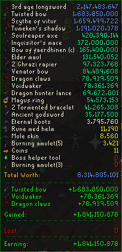

# Lite Utilities Plugin

Provides a neat oversight for your current profits and total value of your inventory.

Additionally, it keeps track of your profit and losses made during your activity!

- **Swap Between G.E and H.A prices**
- **You can seamlessly toggle between Profits/Loss value and Inventory value via a configurable HotKey!**
- **Setup Auto-reseting profits upon banking**
- **Exclude items from the list by writing their name.**

- **Hover over the coins to view the tooltip** *(Tooltip border and seperators color based on ur profit margin)*

     

- **Enable/Disable containers** *(border colors depending on Inv value, Profit/Loss Value)*

    

     

- **Exact prices**

   

- **Settings Overview**

  

## **Safety & Compliance**

All plugins that are successfully merged into the [Plugin Hub](https://github.com/runelite/plugin-hub) are reviewed and verified by the RuneLite development team, ensuring they are safe to use. For more information, you can view the [Plugin Hub readme](https://github.com/runelite/plugin-hub#Reviewing).

Furthermore, [RuneLite itself has been confirmed as fully compliant by Jagex](https://secure.runescape.com/m=news/a=13/another-message-about-unofficial-clients?oldschool=1).

---

## **Creator Tag**

For additional support or questions, reach out via [Discord](https://discord.gg/RQ9H9naf7E).